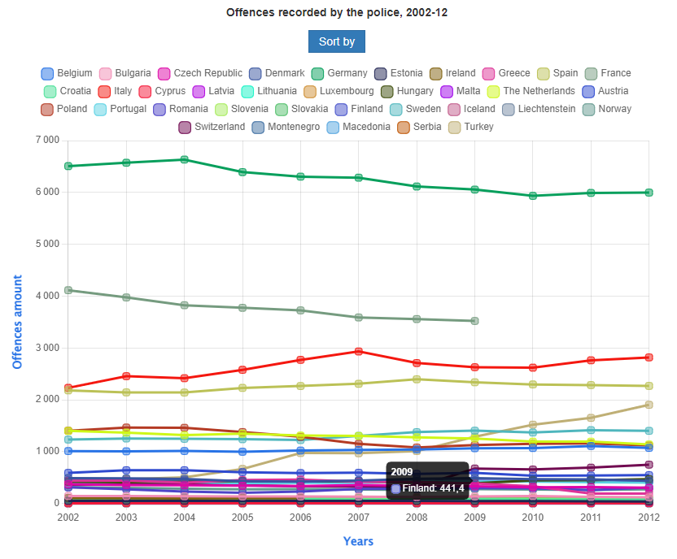
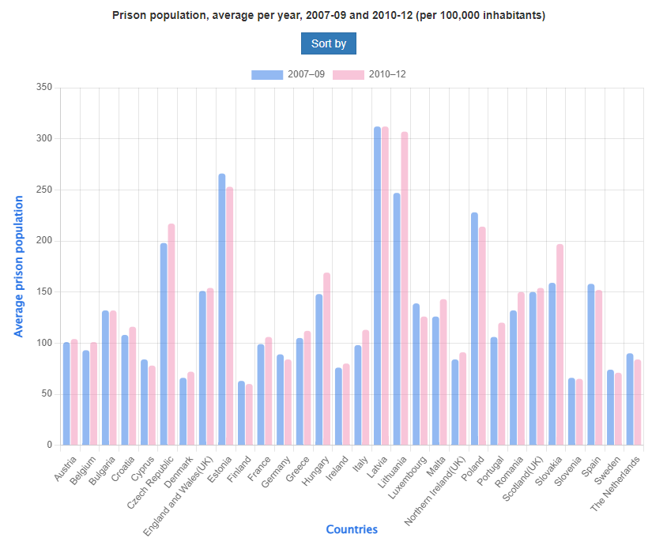
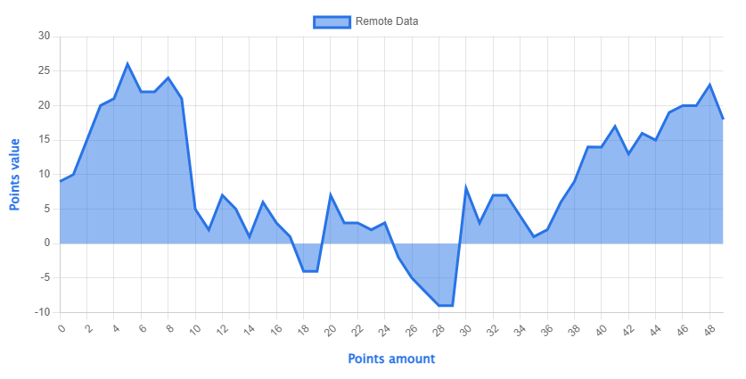

# Data visualisation

js-datavisualisation-challenge is a project to practise/learn how to deal with :

- **DOM** manipulation
- **AJAX**/**FETCH** request
- Using **Third-party libraries**
- **problem-solving** : design a logical solution to implement the expected result
- Debugging using the console
- Understand the notion of **"separation of concerns"**

---
### Github page

You can see the final result on the Github page [here](https://dalcqarnaud.github.io/js-datavisualisation-challenge/)

---

Other graphs :

## The mission

You work in the Multimedia department of one of the European Union institutions. This morning, Johnny Hasnoclew, your Project Manager, sends you on a mission: one of the in-house journalists has published a new article on the institution's website. The article in question is already integrated with an **html** / **css** / **Javascript file**.

He asks you to make it more *rich*, more *interactive*, more... *sexy* (The use of that specific adjective indicates that Johnny certainly worked in advertising before, the poor guy).

That's exactly what you're going to do, by adding two **interactive data visualisation graphics** using javascript.  These graphs will be interactive in the sense that the user can manipulate the graph, such as filtering data, or reveal detailed data when the mouse hovers over it. You are free to design the interaction in your project.

### 1. Inline data (data in the document)
In this html file, you will find two data tables. Use JavaScript to traverse the DOM to insert right above each of these tables a representation of its data in the form of an interactive graph.

If javascript is disabled, the graph does not appear. If javascript is enabled, the graph appears between the title and the table.

### 2. Remote data, in real-time, via ajax
There are data sitting at this URL :  [https://canvasjs.com/services/data/datapoints.php](https://canvasjs.com/services/data/datapoints.php)

Retrieve the data via Ajax, and use it to insert a graph that refreshes every second, just below the main title (`h1`) of the article.

Don't hesitate to adapt the code provided in this tutorial: [Live Updating Charts from JSON API & AJAX](https://canvasjs.com/docs/charts/how-to/live-updating-javascript-charts-json-api-ajax/), but adapt it to this third-party library: [chart.js](https://www.chartjs.org/) or [ToastUi-Chart](https://ui.toast.com/tui-chart/), because this tutorial uses another (not-free) library (canvasJS).

**Again**: if javascript is disabled, the graph does not appear. If javascript is enabled, the graph appears.

---
## Constraints
- You can't edit the html file.
- You have the choice of the type of graphics. Considers the most relevant based on the data and what story they can "tell".
- The choice of the javascript library is limited to the 2 libraries offered (there are many others, but these are references and are very popular)
---

## How to Contribute 

* Create a personal fork of the project on Github.
* Clone the fork on your local machine. Your remote repo on Github is called `origin`.
* Add the original repository as a remote called `upstream`.
* If you created your fork a while ago be sure to pull upstream changes into your local repository.
* Create a new branch to work on! Branch from `main`.
* Implement/fix your feature, comment your code.
* Follow the code style of the project, including indentation.
* If the project have tests run them!
* Write or adapt tests as needed.
* Add or if any documentation exist change it as needed.
* Squash your commits into a single commit with git's [interactive rebase](https://help.github.com/articles/interactive-rebase). Create a new branch if necessary.
* Push your branch to your fork on Github, the remote `origin`.
* From your fork open a pull request in the correct branch. Target the project's `main`!
* …
* Once the pull request is approved and merged you can pull the changes from `upstream` to your local repo and delete your extra branch(es).

And last but not least: Always write your commit messages in the present tense. Your commit message should describe what the commit, when applied, does to the code – not what you did to the code.